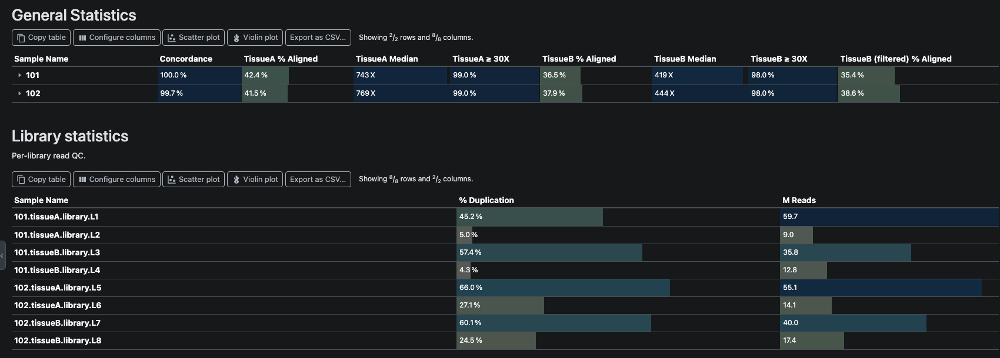

# multiqc-pivot

[](https://github.com/clintval/multiqc-pivot/actions/workflows/tests.yml?query=branch%3Amain)
[](https://github.com/clintval/multiqc-pivot)
[](https://docs.basedpyright.com/latest/)
[](https://mypy-lang.org/)
[](https://docs.astral.sh/ruff/)

A [MultiQC](https://multiqc.info) plugin that folds related samples into one General Statistics row per group.

## Installation

```console
pip install multiqc-pivot
```
## Introduction

MultiQC gives every sample its own row.
When one subject yields several samples that are measured by different methods, say a tumour and a normal, or two tissues and a paired-genotype check, the General Statistics table ends up with a block of half-empty rows per subject.
MultiQC's own [sample grouping](https://docs.seqera.io/multiqc/reports/customisation#sample-grouping) only fills the group's row for the handful of modules that know how to merge their metrics.

This plugin runs after every module has reported and rebuilds the table:

1. Rows for one group fold into a single row, and every folded column is prefixed by which method it came from.
2. The original rows stay beneath the group row, so they still can be viewed.
3. Rows for a level that does not belong in the table, such as per-library read QC, move out into their own table under General Statistics with whatever grouping they already had.
4. Hover text, color scales, formats and hidden-by-default state carry over from the module that produced each column.

## Usage

Add a `sample_pivot` block to any MultiQC config, for example with `--config my_config.yml`.

So, with these sample names:

```text
101.subject
101.tissueA
101.tissueB
101.tissueB (filtered data, though)
101.tissueA.library.L1
101.tissueA.library.L2
```

This configuration produces one row named `101` carrying `Concordance`, `TissueA Median`, `TissueB Median`, `TissueB (filtered) % Aligned` and so on, and moves the library rows into a separate table:

```yaml
sample_pivot:
  group: '^(?P<group>[^. ]+)\.'
  levels:
    - match: '\.subject$'
    - match: '\.(?P<analyte>tissueA|tissueB)$'
      label: '{analyte}'
    - match: '\.(?P<analyte>tissueA|tissueB) \(filtered\)$'
      label: '{analyte} (filtered)'
    - match: '\.library\.'
      table: Library statistics
  label_order: [tissueA, tissueB, tissueB (filtered)]
  tables:
    Library statistics:
      description: Per-library read QC; read pairs nest under their library.
```

And your report will look like:



### YAML Configuration Reference

| Key | Meaning |
| --- | --- |
| `group` | A regular expression searched in every matched sample name. Its `(?P<group>...)` capture names the folded row. Required. |
| `levels` | An ordered list; the first level whose `match` is found in a sample name wins. Required. |
| `levels[].match` | A regular expression searched in the sample name. Named captures are available to `label`. |
| `levels[].label` | A format string built from the captures of `match`. Columns of matching rows are renamed with it and folded onto the group row; the row itself stays beneath. Omit it, and omit `table`, to fold the row's columns onto the group row unchanged. |
| `levels[].table` | The name of a table that receives matching rows instead of General Statistics. Rows keep their grouping, so paired reads stay nested under their library. Tables sit directly under General Statistics in the order their levels are listed. |
| `column_title` | How a pivoted column is titled. `{label}` is the label as written, `{Label}` has its first letter upper-cased, `{title}` is the module's title. Default `{Label} {title}`. |
| `label_order` | Labels in the order their column blocks should appear. Labels not listed follow in order of first appearance. |
| `tables` | Presentation of the tables named by `levels[].table`, currently a `description` each. |

> [!TIP]
> A sample that matches no level is left where it was. 
> A sample that matches a level but not `group` is left alone as well, with a warning in the log.
> Columns that a module did not declare a header for are dropped from folded rows, as MultiQC would have dropped them anyway.

### Limitations

1. Sample names are matched after MultiQC has cleaned them, so you must write patterns against the names you see in an un-pivoted report.
2. Only one level of nesting exists in a MultiQC table. Rows moved into a secondary table keep the nesting they already had; rows folded into a group row become its children, and cannot nest further.
3. Two rows in the same group that resolve to the same label collide. The first value is kept and a warning is logged, so make labels specific enough to tell such rows apart.

## Development and Testing

See the [contributing guide](./CONTRIBUTING.md) for more information.
